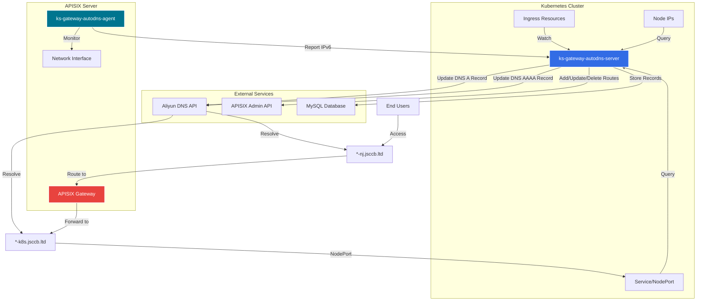

# KubeSphere Gateway AutoDNS

[](https://github.com/veater/ks-gateway-autodns/actions/workflows/build-server.yml)
[](https://github.com/veater/ks-gateway-autodns/actions/workflows/build-agent.yml)
[](https://github.com/veater/ks-gateway-autodns/actions/workflows/helm-release.yml)

自动管理KubeSphere Ingress资源的DNS解析和APISIX网关转发规则的系统。

## 概述

本项目包含两个组件:

1. **ks-gateway-autodns-server**: 运行在K8S集群中的服务，监听Ingress资源变化，自动管理阿里云DNS记录和APISIX路由规则
2. **ks-gateway-autodns-agent**: 运行在APISIX服务器上的代理程序，监控公网IPv6地址变化并上报服务器，实现DDNS功能

## 架构图



## 工作流程

1. **Ingress监听**: Server监听K8S集群中以`kubesphere-router-namespace-`开头的IngressClass对应的Ingress资源
2. **DNS记录管理**: 当检测到Ingress变化时，自动在阿里云DNS添加/更新/删除A记录，指向集群Node节点IP
3. **APISIX路由管理**: 同时在外部APISIX添加HTTP转发规则，将`*-nj.jsccb.ltd`转发到`*-k8s.jsccb.ltd:NodePort`
4. **公网IP监控**: Agent每5秒检测APISIX服务器的公网IPv6地址变化
5. **DDNS更新**: 当公网IP变化时，Server自动更新所有外部域名(`*-nj.jsccb.ltd`)的AAAA记录

## 快速开始

### 部署Server到Kubernetes

1. 添加Helm仓库:
```bash
helm repo add ks-gateway-autodns https://veater.github.io/ks-gateway-autodns/charts
helm repo update
```

2. 创建values配置文件 `values-prod.yaml`:
```yaml
image:
  repository: veater/ks-gateway-autodns-server
  tag: latest

database:
  url: "jdbc:mysql://mysql-host:3306/autodns?useSSL=false&serverTimezone=UTC"
  username: "autodns"
  password: "your-db-password"

aliyun:
  accessKeyId: "your-aliyun-access-key-id"
  accessKeySecret: "your-aliyun-access-key-secret"
  domain: "jsccb.ltd"
  regionId: "cn-hangzhou"

apisix:
  adminUrl: "http://your-apisix-server:9180"
  adminKey: "your-apisix-admin-key"

security:
  apiToken: "your-secure-api-token"

config:
  ingressClassPrefix: "kubesphere-router-namespace-"
  hostSuffix: "-k8s.jsccb.ltd"
  externalDomainSuffix: "-nj.jsccb.ltd"
```

3. 部署:
```bash
helm install ks-gateway-autodns ks-gateway-autodns/ks-gateway-autodns-server \
  -f values-prod.yaml \
  -n kubesphere-system \
  --create-namespace
```

4. 手动创建Ingress以暴露公网IP上报接口（请根据实际情况配置）

### 部署Agent到APISIX服务器

1. 克隆仓库:
```bash
git clone https://github.com/veater/ks-gateway-autodns.git
cd ks-gateway-autodns/ks-gateway-autodns-agent
```

2. 创建环境变量文件 `.env`:
```bash
cp .env.example .env
# 编辑 .env 文件，填入配置
SERVER_URL=http://your-server-url:8080
API_TOKEN=your-secure-api-token
CHECK_INTERVAL=5
```

3. 启动Agent:
```bash
docker-compose up -d
```

4. 查看日志:
```bash
docker-compose logs -f
```

## 详细文档

- [Server详细文档](./ks-gateway-autodns-server/README.md)
- [Agent详细文档](./ks-gateway-autodns-agent/README.md)

## 镜像信息

- Server镜像: `veater/ks-gateway-autodns-server:latest`
- Agent镜像: `veater/ks-gateway-autodns-agent:latest`

所有镜像均托管在Docker Hub。

## 技术栈

### Server
- Java 17
- Spring Boot 3.2.2
- GraalVM Native Image
- MySQL
- Kubernetes Client
- Aliyun SDK

### Agent
- Python 3.11
- Alpine Linux
- netifaces
- requests

## 许可证

MIT License

## 维护者

- veater

## 贡献

欢迎提交Issue和Pull Request。

## 注意事项

1. Server需要集群级别的RBAC权限来监听Ingress、Service和Node资源
2. Agent需要使用host网络模式才能正确检测服务器的公网IP地址
3. 确保阿里云AccessKey有足够的DNS管理权限
4. APISIX Admin Key需要有足够的权限来管理路由
5. 数据库操作记录默认保留365天，可通过配置调整
