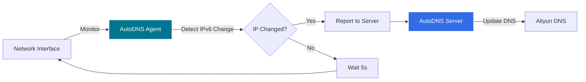

# KS Gateway AutoDNS Agent

KubeSphere网关自动DNS代理程序，运行在APISIX服务器上，负责监控公网IPv6地址变化并上报到AutoDNS Server，实现DDNS功能。

## 功能特性

1. **IPv6地址监控**: 实时监控服务器网络接口的IPv6地址变化
2. **临时地址优先**: 优先选择临时IPv6地址（Privacy Extensions），提高隐私保护
3. **自动上报**: 检测到IP地址变化时自动上报到AutoDNS Server
4. **定时检查**: 每5秒（可配置）检查一次IP地址
5. **轻量级**: 基于Python和Alpine Linux，镜像体积小
6. **容错机制**: 上报失败不影响程序运行，始终保持监控状态

## 架构说明



## 快速开始

### 使用Docker Compose部署（推荐）

1. 克隆仓库:
```bash
git clone https://github.com/veater/ks-gateway-autodns.git
cd ks-gateway-autodns/ks-gateway-autodns-agent
```

2. 创建环境变量文件:
```bash
cp .env.example .env
```

3. 编辑 `.env` 文件:
```bash
# Server URL (必需)
SERVER_URL=http://your-server-url:8080

# API Token (必需)
API_TOKEN=your-secure-api-token

# 检查间隔（秒，可选，默认5）
CHECK_INTERVAL=5

# 网络接口（必需，如eth0, ens33, enp0s3等）
NETWORK_INTERFACE=eth0
```

4. 启动服务:
```bash
docker-compose up -d
```

5. 查看日志:
```bash
docker-compose logs -f
```

6. 停止服务:
```bash
docker-compose down
```

### 使用Docker直接运行

```bash
docker run -d \
  --name ks-gateway-autodns-agent \
  --network host \
  --restart unless-stopped \
  -e SERVER_URL=http://your-server-url:8080 \
  -e API_TOKEN=your-secure-api-token \
  -e CHECK_INTERVAL=5 \
  -e NETWORK_INTERFACE=eth0 \
  veater/ks-gateway-autodns-agent:latest
```

### 本地开发运行

1. 安装依赖:
```bash
pip install -r requirements.txt
```

2. 设置环境变量:
```bash
export SERVER_URL=http://localhost:8080
export API_TOKEN=test-token
export CHECK_INTERVAL=5
export NETWORK_INTERFACE=eth0
```

3. 运行程序:
```bash
python agent.py
```

## 配置说明

### 环境变量

| 变量名 | 必需 | 说明 | 默认值 | 示例 |
|--------|------|------|--------|------|
| `SERVER_URL` | 是 | AutoDNS Server地址 | - | `http://server:8080` |
| `API_TOKEN` | 是 | API认证Token | - | `secure-token-123` |
| `CHECK_INTERVAL` | 否 | IP检查间隔（秒） | `5` | `10` |
| `NETWORK_INTERFACE` | 是 | 监控的网络接口 | - | `eth0` |

### 网络接口说明

- `NETWORK_INTERFACE` 必须指定，只监控指定的单个网络接口
- 程序会自动过滤掉链路本地地址（`fe80::`）和回环地址（`::1`）
- **优先选择临时IPv6地址**：程序会自动区分临时地址和永久地址，优先上报临时地址
  - 临时地址（Privacy Extensions）：用于提高隐私保护，地址会定期变化
  - 永久地址（EUI-64）：基于MAC地址生成，通常包含 `ff:fe` 或 `fffe` 特征
- 如果没有临时地址，才会使用永久地址
- 常见网络接口名称: `eth0`, `ens33`, `enp0s3`, `wlan0` 等

## 工作流程

1. 启动时读取环境变量配置
2. 每隔配置的时间间隔检查网络接口的IPv6地址
3. 如果检测到IPv6地址变化:
   - 记录日志: `IPv6 address changed: old_ip -> new_ip`
   - 向Server发送POST请求上报新IP
   - **无论上报是否成功，都更新本地记录的IP地址**（避免重复上报同一地址）
4. 如果IP地址未变化，记录调试日志
5. 如果发生网络错误或异常，记录错误日志并继续运行，不会退出程序

## API调用示例

Agent向Server发送的请求格式:

```http
POST /api/v1/public-ip HTTP/1.1
Host: your-server:8080
X-API-Token: your-secure-api-token
Content-Type: application/json

{
  "ipAddress": "2001:db8::1"
}
```

响应:
```http
HTTP/1.1 200 OK
Content-Type: text/plain

Public IP updated successfully
```

## 日志说明

### 正常运行日志

```
2026-02-01 10:00:00 - INFO - Starting ks-gateway-autodns-agent
2026-02-01 10:00:00 - INFO - Server URL: http://server:8080
2026-02-01 10:00:00 - INFO - Check interval: 5 seconds
2026-02-01 10:00:00 - INFO - Monitoring network interface: eth0
2026-02-01 10:00:00 - DEBUG - Found temporary IPv6 address 2001:db8::a1b2:c3d4:e5f6:7890 on interface eth0
2026-02-01 10:00:00 - DEBUG - Found permanent IPv6 address 2001:db8::1234:56ff:fe78:9abc on interface eth0
2026-02-01 10:00:00 - DEBUG - Selected temporary IPv6 address: 2001:db8::a1b2:c3d4:e5f6:7890
2026-02-01 10:00:05 - INFO - IPv6 address changed: None -> 2001:db8::a1b2:c3d4:e5f6:7890
2026-02-01 10:00:05 - INFO - Successfully reported IP address: 2001:db8::a1b2:c3d4:e5f6:7890
2026-02-01 10:00:10 - DEBUG - IPv6 address unchanged: 2001:db8::a1b2:c3d4:e5f6:7890
```

### 错误日志

```
2026-02-01 10:00:00 - ERROR - SERVER_URL environment variable is not set
2026-02-01 10:00:05 - ERROR - Network error while reporting IP address: Connection refused
2026-02-01 10:00:10 - WARNING - No IPv6 address detected
2026-02-01 10:00:15 - ERROR - Failed to report IP address. Status code: 401, Response: Invalid API token
```

## 网络要求

### 必需条件

1. **Host网络模式**: Agent必须以host网络模式运行才能正确检测服务器的公网IP
2. **IPv6支持**: 服务器必须配置了IPv6地址
3. **网络连通性**: Agent必须能够访问AutoDNS Server的API接口

### Docker Compose网络配置

```yaml
services:
  ks-gateway-autodns-agent:
    network_mode: host  # 必需，使用host网络模式
```

### 防火墙配置

确保以下端口可访问:
- AutoDNS Server的HTTP端口（默认8080）

## 故障排查

### 查看日志
```bash
# Docker Compose
docker-compose logs -f

# Docker
docker logs -f ks-gateway-autodns-agent
```

### 常见问题

#### 1. 无法检测到IPv6地址

**现象**: 日志显示 `No IPv6 address detected` 或 `NETWORK_INTERFACE is not specified`

**解决方法**:
- 检查是否设置了 `NETWORK_INTERFACE` 环境变量
- 检查服务器是否配置了IPv6地址: `ip -6 addr`
- 检查是否使用了host网络模式
- 确认指定的网络接口名称正确: `ip link show`
- 确认该接口上有非链路本地的IPv6地址

#### 2. 上报失败（401错误）

**现象**: 日志显示 `Status code: 401, Response: Invalid API token`

**解决方法**:
- 检查API_TOKEN是否与Server配置一致
- 检查环境变量是否正确设置

#### 3. 网络连接失败

**现象**: 日志显示 `Network error while reporting IP address: Connection refused`

**解决方法**:
- 检查SERVER_URL是否正确
- 检查Server是否正常运行: `curl http://server:8080/actuator/health`
- 检查网络连通性: `ping server-host`
- 检查防火墙规则

#### 4. netifaces模块错误

**现象**: 日志显示 `netifaces module not installed`

**解决方法**:
- 重新构建镜像确保依赖安装完整
- 如果本地运行，执行: `pip install -r requirements.txt`

## 系统要求

- Docker 20.10+
- Docker Compose 2.0+ (如果使用docker-compose)
- 服务器需要支持IPv6
- Python 3.11+ (如果本地运行)

## 镜像信息

- **镜像名称**: `veater/ks-gateway-autodns-agent:latest`
- **基础镜像**: `python:3.11-alpine`
- **镜像大小**: ~50MB
- **支持架构**: linux/amd64, linux/arm64

## 安全建议

1. **API Token安全**:
   - 使用强随机字符串作为API Token
   - 不要在代码或公开仓库中硬编码Token
   - 定期轮换Token

2. **网络隔离**:
   - 使用防火墙限制Agent到Server的访问
   - 考虑使用HTTPS保护API通信

3. **容器安全**:
   - Agent以非root用户运行（UID 1001）
   - 使用最小化的Alpine基础镜像

## 监控和告警

### Prometheus监控（规划中）

可以通过日志分析实现监控:
- IP地址变化频率
- 上报成功率
- 网络错误次数

### 健康检查

检查Agent是否正常运行:
```bash
docker ps | grep ks-gateway-autodns-agent
docker logs --tail 10 ks-gateway-autodns-agent
```

## 更新和维护

### 更新到最新版本
```bash
docker-compose pull
docker-compose up -d
```

### 查看版本
```bash
docker images | grep ks-gateway-autodns-agent
```

### 清理旧版本
```bash
docker image prune -f
```

## 开发

### 构建镜像
```bash
docker build -t veater/ks-gateway-autodns-agent:latest .
```

### 多架构构建
```bash
docker buildx build \
  --platform linux/amd64,linux/arm64 \
  -t veater/ks-gateway-autodns-agent:latest \
  --push .
```

### 代码结构

```python
agent.py
├── get_ipv6_address()    # 获取IPv6地址
├── report_ip()            # 上报IP地址
└── main()                 # 主循环
```

## 与Server的集成

Agent和Server通过HTTP API通信:

1. Agent检测到IP变化
2. 发送POST请求到Server的 `/api/v1/public-ip` 接口
3. Server验证API Token
4. Server更新数据库中的公网IP记录
5. Server对比新旧IP，如有变化则更新所有外部域名的DNS记录
6. Server返回成功响应

## 许可证

MIT License

## 支持

如有问题，请提交Issue到GitHub仓库。
