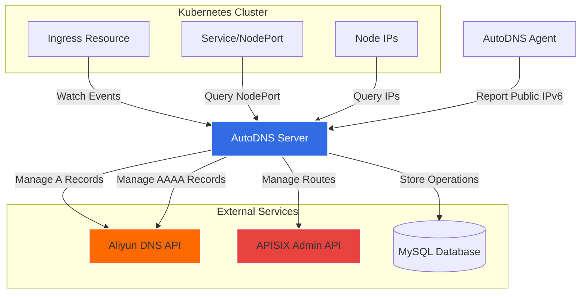

# KS Gateway AutoDNS Server

KubeSphere网关自动DNS管理服务器，负责监听Kubernetes Ingress资源变化，自动管理阿里云DNS记录和APISIX路由规则。

## 功能特性

1. **Ingress资源监听**: 实时监听K8S集群中IngressClass名称为`kubesphere-router-namespace-*`开头且host以`-k8s.jsccb.ltd`结尾的Ingress资源
2. **自动DNS管理**: 
   - 自动在阿里云DNS创建/更新/删除A记录
   - 解析记录指向集群所有Node节点的IPv4地址
3. **APISIX路由管理**:
   - 自动在外部APISIX添加/更新/删除HTTP转发规则
   - 将外部域名(`*-nj.jsccb.ltd`)转发到内部域名(`*-k8s.jsccb.ltd:NodePort`)
4. **DDNS功能**:
   - 提供公网IP上报接口
   - 自动更新所有外部域名的AAAA记录（IPv6）
5. **操作记录**:
   - 所有APISIX操作记录存储到MySQL数据库
   - 自动清理365天前的历史记录

## 架构说明



## 快速开始

### 使用Helm部署

1. 添加Helm仓库:
```bash
helm repo add ks-gateway-autodns https://veater.github.io/ks-gateway-autodns/charts
helm repo update
```

2. 创建配置文件 `values-prod.yaml`:
```yaml
image:
  repository: veater/ks-gateway-autodns-server
  tag: latest

replicaCount: 1

# MySQL配置 (内置MySQL，可选)
mysql:
  enabled: true  # 设置为false使用外部MySQL
  auth:
    rootPassword: "your-root-password"
    database: "autodns"
    username: "autodns"
    password: "your-mysql-password"
  persistence:
    enabled: true
    size: 8Gi
    storageClass: ""  # 留空使用默认StorageClass

# 如果使用外部MySQL，设置mysql.enabled=false并配置以下database部分
database:
  url: "jdbc:mysql://external-mysql:3306/autodns?useSSL=false&serverTimezone=UTC"
  username: "autodns"
  password: "your-secure-password"

aliyun:
  accessKeyId: "your-access-key-id"
  accessKeySecret: "your-access-key-secret"
  domain: "jsccb.ltd"
  regionId: "cn-hangzhou"

apisix:
  adminUrl: "http://apisix-server:9180"
  adminKey: "your-apisix-admin-key"

security:
  apiToken: "your-secure-api-token"

config:
  ingressClassPrefix: "kubesphere-router-namespace-"
  hostSuffix: "-k8s.jsccb.ltd"
  externalDomainSuffix: "-nj.jsccb.ltd"

resources:
  limits:
    cpu: 500m
    memory: 512Mi
  requests:
    cpu: 100m
    memory: 128Mi
```

3. 部署应用:
```bash
helm install ks-gateway-autodns ks-gateway-autodns/ks-gateway-autodns-server \
  -f values-prod.yaml \
  -n kubesphere-system \
  --create-namespace
```

4. 验证部署:
```bash
kubectl get pods -n kubesphere-system -l app.kubernetes.io/name=ks-gateway-autodns-server
kubectl logs -n kubesphere-system -l app.kubernetes.io/name=ks-gateway-autodns-server
```

### 手动部署（使用Docker镜像）

1. 使用Docker Compose快速启动MySQL:
```yaml
# docker-compose.yml
version: '3.8'
services:
  mysql:
    image: mysql:8.0
    container_name: autodns-mysql
    environment:
      MYSQL_ROOT_PASSWORD: autodns123
      MYSQL_DATABASE: autodns
      MYSQL_USER: autodns
      MYSQL_PASSWORD: autodns123
    ports:
      - "3306:3306"
    volumes:
      - mysql-data:/var/lib/mysql
    healthcheck:
      test: ["CMD", "mysqladmin", "ping", "-h", "localhost", "-u", "root", "-p$$MYSQL_ROOT_PASSWORD"]
      interval: 10s
      timeout: 5s
      retries: 3

volumes:
  mysql-data:
```

启动MySQL:
```bash
docker-compose up -d mysql
```

2. 创建环境变量文件 `.env`:
```bash
DB_URL=jdbc:mysql://mysql-host:3306/autodns?useSSL=false&serverTimezone=UTC
DB_USERNAME=autodns
DB_PASSWORD=your-password
ALIYUN_ACCESS_KEY_ID=your-access-key-id
ALIYUN_ACCESS_KEY_SECRET=your-access-key-secret
ALIYUN_DOMAIN=jsccb.ltd
ALIYUN_REGION_ID=cn-hangzhou
APISIX_ADMIN_URL=http://apisix:9180
APISIX_ADMIN_KEY=your-admin-key
API_TOKEN=your-secure-token
INGRESS_CLASS_PREFIX=kubesphere-router-namespace-
HOST_SUFFIX=-k8s.jsccb.ltd
EXTERNAL_DOMAIN_SUFFIX=-nj.jsccb.ltd
```

3. 运行容器:
```bash
docker run -d \
  --name ks-gateway-autodns-server \
  --env-file .env \
  -p 8080:8080 \
  veater/ks-gateway-autodns-server:latest
```

## 配置说明

### 必需配置

| 配置项 | 说明 | 示例 |
|--------|------|------|
| `database.url` | MySQL数据库连接URL | `jdbc:mysql://mysql:3306/autodns` |
| `database.username` | 数据库用户名 | `autodns` |
| `database.password` | 数据库密码 | `password` |
| `aliyun.accessKeyId` | 阿里云AccessKey ID | `LTAI***` |
| `aliyun.accessKeySecret` | 阿里云AccessKey Secret | `****` |
| `apisix.adminUrl` | APISIX Admin API地址 | `http://apisix:9180` |
| `apisix.adminKey` | APISIX Admin Key | `****` |
| `security.apiToken` | API认证Token | `secure-token` |

### 可选配置

| 配置项 | 说明 | 默认值 |
|--------|------|--------|
| `config.ingressClassPrefix` | Ingress Class前缀 | `kubesphere-router-namespace-` |
| `config.hostSuffix` | 内部域名后缀 | `-k8s.jsccb.ltd` |
| `config.externalDomainSuffix` | 外部域名后缀 | `-nj.jsccb.ltd` |
| `config.kubesphereNamespace` | KubeSphere控制平面命名空间 | `kubesphere-controls-system` |
| `config.recordRetentionDays` | 操作记录保留天数 | `365` |
| `aliyun.domain` | 阿里云DNS域名 | `jsccb.ltd` |
| `aliyun.regionId` | 阿里云Region | `cn-hangzhou` |

## API接口

### 公网IP上报接口

上报公网IP地址（用于DDNS功能）。

**端点**: `POST /api/v1/public-ip`

**请求头**:
```
X-API-Token: your-api-token
Content-Type: application/json
```

**请求体**:
```json
{
  "ipAddress": "2001:db8::1"
}
```

**响应**:
- `200 OK`: IP地址已成功更新
- `401 Unauthorized`: API Token无效
- `500 Internal Server Error`: 更新失败

## 数据库表结构

### dns_records
存储DNS记录信息

| 字段 | 类型 | 说明 |
|------|------|------|
| id | BIGINT | 主键 |
| host | VARCHAR(255) | 域名 |
| rr | VARCHAR(255) | 记录值 |
| ip_addresses | TEXT | IP地址列表 |
| node_port | INT | NodePort端口 |
| record_id | VARCHAR(50) | 阿里云记录ID |
| record_type | VARCHAR(20) | 记录类型(A/AAAA) |
| created_at | DATETIME | 创建时间 |
| updated_at | DATETIME | 更新时间 |

### apisix_operations
存储APISIX操作日志

| 字段 | 类型 | 说明 |
|------|------|------|
| id | BIGINT | 主键 |
| operation | VARCHAR(20) | 操作类型(ADD/UPDATE/DELETE) |
| upstream_host | VARCHAR(255) | 上游主机 |
| external_host | VARCHAR(255) | 外部主机 |
| node_port | INT | NodePort端口 |
| request_body | TEXT | 请求体 |
| response_body | TEXT | 响应体 |
| status | VARCHAR(20) | 状态(SUCCESS/FAILED) |
| error_message | TEXT | 错误信息 |
| created_at | DATETIME | 创建时间 |

### public_ip_records
存储公网IP记录

| 字段 | 类型 | 说明 |
|------|------|------|
| id | BIGINT | 主键 |
| identifier | VARCHAR(100) | 标识符 |
| ip_address | VARCHAR(100) | IP地址 |
| created_at | DATETIME | 创建时间 |
| updated_at | DATETIME | 更新时间 |

## 工作流程示例

假设有一个服务名为`app-a`:

1. 在K8S中创建Ingress，host为`app-a-k8s.jsccb.ltd`，IngressClass为`kubesphere-router-namespace-app-a`
2. Server检测到Ingress变化
3. Server查询`kubesphere-controls-system`命名空间中名为`kubesphere-router-app-a`的Service，获取NodePort（假设为31540）
4. Server查询所有Node节点的内网IP（假设为`192.168.1.10, 192.168.1.11`）
5. Server在阿里云DNS创建A记录: `app-a-k8s.jsccb.ltd` -> `192.168.1.10, 192.168.1.11`
6. Server在APISIX创建路由: `app-a-nj.jsccb.ltd` -> `app-a-k8s.jsccb.ltd:31540`
7. Agent检测到公网IPv6地址为`2001:db8::1`并上报
8. Server在阿里云DNS创建AAAA记录: `app-a-nj.jsccb.ltd` -> `2001:db8::1`
9. 所有操作记录存储到MySQL数据库

现在用户可以通过`app-a-nj.jsccb.ltd`访问服务。

## RBAC权限

应用需要以下Kubernetes权限:

```yaml
rules:
  - apiGroups: ["networking.k8s.io"]
    resources: ["ingresses", "ingressclasses"]
    verbs: ["get", "list", "watch"]
  - apiGroups: [""]
    resources: ["services", "nodes"]
    verbs: ["get", "list", "watch"]
```

## 故障排查

### 查看日志
```bash
kubectl logs -n kubesphere-system -l app.kubernetes.io/name=ks-gateway-autodns-server -f
```

### 常见问题

1. **Ingress未被监听**:
   - 检查IngressClass名称是否以配置的前缀开头
   - 检查host是否以配置的后缀结尾

2. **DNS记录未创建**:
   - 检查阿里云AccessKey是否有DNS管理权限
   - 查看日志中的错误信息

3. **APISIX路由未创建**:
   - 检查APISIX Admin URL是否可访问
   - 检查Admin Key是否正确

4. **NodePort未找到**:
   - 检查Service是否存在于配置的命名空间
   - 检查Service是否有名为`http`的端口

## 构建

### 使用Maven构建JAR
```bash
cd ks-gateway-autodns-server
./mvnw clean package
```

### 构建Docker镜像
```bash
docker build -t veater/ks-gateway-autodns-server:latest .
```

### 构建GraalVM Native Image
```bash
./mvnw -Pnative native:compile
```

## 开发

### 本地运行
```bash
export DB_URL=jdbc:mysql://localhost:3306/autodns
export DB_USERNAME=root
export DB_PASSWORD=password
export ALIYUN_ACCESS_KEY_ID=your-key
export ALIYUN_ACCESS_KEY_SECRET=your-secret
export APISIX_ADMIN_URL=http://localhost:9180
export APISIX_ADMIN_KEY=your-key
export API_TOKEN=test-token

./mvnw spring-boot:run
```

## 许可证

MIT License
